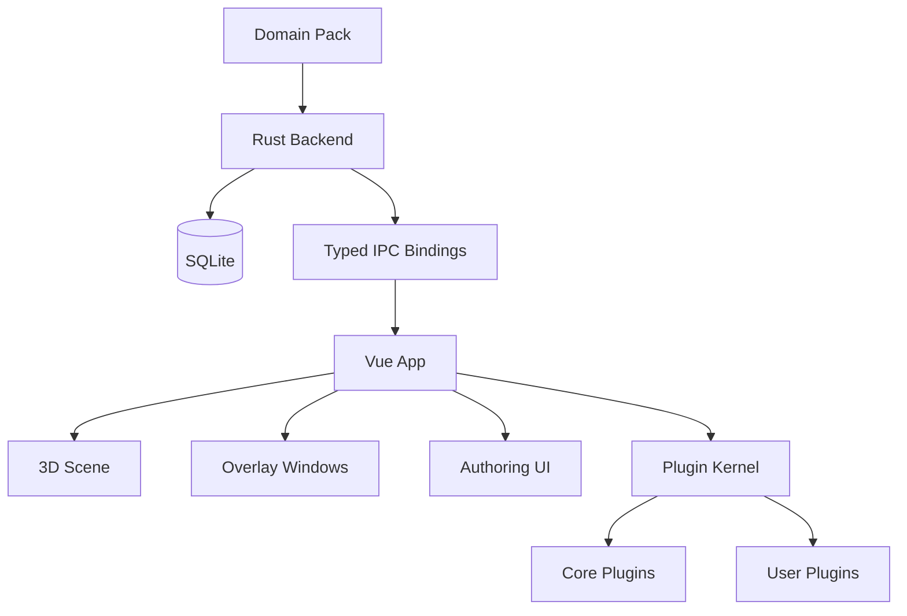
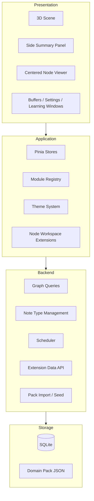
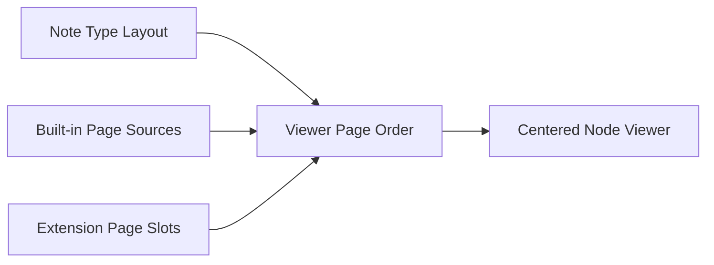
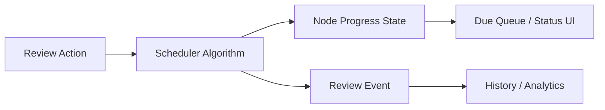
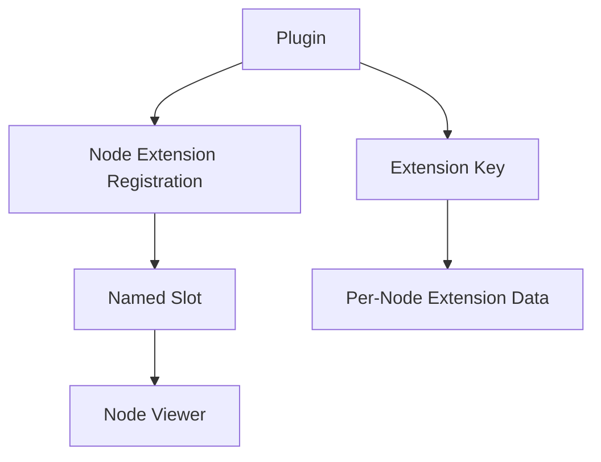

# Design

## Purpose

The system is an offline-first desktop application for exploring and learning through a 3D graph of knowledge nodes.

Design goals:

- keep the graph as the primary surface
- treat nodes as structured knowledge objects, not plain text blobs
- separate graph data, learning logic, rendering, and extension concerns
- allow packs, note types, and plugins to reshape the experience without rewriting core code

## Design Principles

- `Graph-first`: navigation and context come from relationships between nodes
- `Structured content`: node presentation is driven by note types and authored pages
- `Backend authority`: persistence, scheduling, and data rules live in Rust/SQLite
- `Frontend composition`: Vue renders windows, pages, controls, and 3D scene behavior
- `Explicit extension points`: plugins extend known surfaces and own their own data namespaces
- `Portable worlds`: domain packs describe worlds in a transportable format

## System Topology

## Layered Architecture

## Core Domain Model

### World

A world is a named graph space containing:

- relation kinds
- node layers
- connection layers
- nodes
- edges
- note types

### Node

A node has two roles at once:

- graph entity
- structured knowledge object

Conceptually a node is composed from:

- graph identity and position
- layer membership
- note type reference
- structured note field values
- learning progress state
- extension-owned data

### Edge

An edge represents a relation between two nodes.

Edge semantics are determined by:

- relation kind
- optional connection layer membership
- styling rules derived from active layers and relation metadata

Connection layers are independent overlays, not a progression chain.

### Note Type

A note type is a reusable template describing:

- field schema
- page layout
- built-in page placement
- extension page placement
- optional metadata

Note types exist to make node presentation predictable and reusable across packs and domains.

## Content Design

### Structured Node Content

Node content is driven by:

- `note_type_id`
- `note_fields`

The design treats fallback plain text as compatibility support, not the main content path.

### Page-Based Node Viewer

The centered node viewer is designed as a slide/page viewer.

It is not a settings inspector.

Viewer pages may come from:

- note type content pages
- built-in pages such as learning/history/connections
- extension pages declared by layout

### Side Summary vs Centered Viewer

Two node surfaces exist by design:

- side summary panel for quick context and actions
- centered node viewer for deep reading and interaction

This split keeps graph navigation lightweight while allowing rich node content when explicitly opened.

## Learning Design

Learning is separated into:

- current node progress state
- review event history
- scheduler algorithm

The scheduler is isolated behind a backend boundary so algorithms can be replaced without changing frontend flow.

## Extensibility Design

### Plugin Surfaces

Plugins may extend:

- module slots
- themes
- node workspace pages/panels

Core plugins establish defaults. User plugins load afterward and may override or extend those defaults.

### Node Extension Model

Node extensions are designed around explicit slots and extension-owned data.

Each extension:

- registers against a known slot
- may render a page or panel
- may persist data under its own extension key

This avoids uncontrolled schema growth in core node records.

## Pack Design

Domain packs are the portable authoring and transport format for worlds.

A pack can describe:

- world metadata
- relation kinds
- node layers
- connection layers
- note types
- nodes
- edges

Design intent:

- packs should preserve the structure of a world
- note types should travel with datasets
- viewer page behavior should come from authored pack data, not hardcoded assumptions

## Separation of Concerns

### Frontend owns

- rendering
- camera and interaction behavior
- window composition
- authoring interfaces
- theme application
- plugin composition

### Backend owns

- graph truth
- persistence
- scheduling
- note type storage
- pack parsing and seeding
- extension data storage

### Packs own

- portable world definition
- reusable note type definitions
- structured node content

## Design Constraints

- node content must remain usable without plugins
- plugins must not require changing core schema for every new feature
- note types must be expressive enough to support multiple domains
- graph interaction must remain primary even as node content becomes richer
- layout semantics must remain data-driven so packs can shape the viewer consistently
